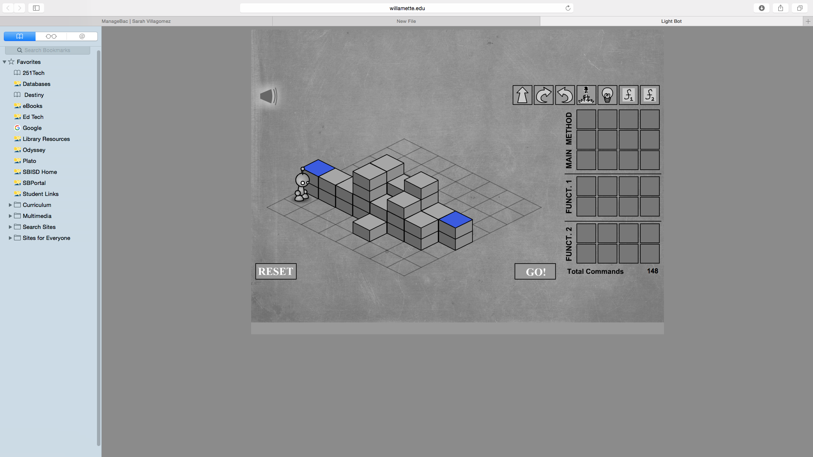

Light Bot is a fun game that helps me problem-solve and learn the basics of coding robots. Game wise, it is a very simple game. But while playing the game, it gets harder and harder each level you pass through, and it often makes you frustrated. But even with the frustration, it helps me overcome solutions and learn more about simple coding. 
The concept of Light Bot and simple coding can help me prepare for the real coding I will be working on with real robots and it will help me become a better problem solver. Since the first Light Bot game was created by a highschooler, it will inspire me to do well in this class while I work with real robots. 

